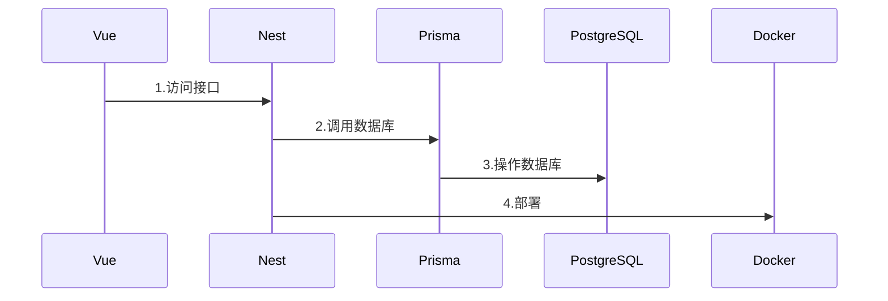
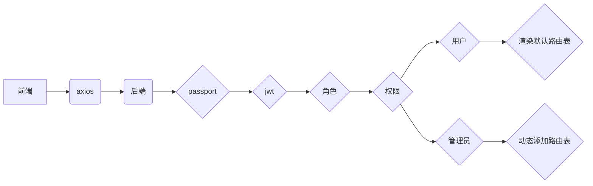
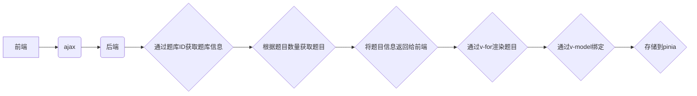

---
# try also 'default' to start simple
theme: seriph
# random image from a curated Unsplash collection by Anthony
# like them? see https://unsplash.com/collections/94734566/slidev
background: '/images/hero@75.b2469a49.jpg'
# apply any windi css classes to the current slide
class: 'text-center'
# https://sli.dev/custom/highlighters.html
highlighter: shiki
# show line numbers in code blocks
lineNumbers: false
fonts:
  sans: 'DM Sans'
  serif: 'DM Serif Display'
  mono: 'Fira Code'
# some information about the slides, markdown enabled
info: |
  ## 在线题库系统
  答辩PPT
# persist drawings in exports and build
drawings:
  persist: true
# use UnoCSS
css: unocss
---
# 在线题库系统
<div mt-5>指导老师：xxx</div>
<div mt-5>答辩人：xxx</div>
<br><br>
答辩时间：2022年12月1日

<div class="abs-br m-6 flex gap-2">
  <button @click="$slidev.nav.openInEditor()" title="Open in Editor" class="text-xl icon-btn opacity-50 !border-none !hover:text-white">
    <carbon:edit />
  </button>
  <a href="https://github.com/slidevjs/slidev" target="_blank" alt="GitHub"
    class="text-xl icon-btn opacity-50 !border-none !hover:text-white">
    <carbon-logo-github />
  </a>
</div>
---
css: unocss
fonts:
  sans: 'DM Sans'
  serif: 'DM Serif Display'
  mono: 'Fira Code'
---
# 为什么选择在线题库系统
1. 市面上的刷题网站和小程序非常多，市场广泛  
2. 跟问卷调查本质相差不大，问卷调查是十分常用的功能  
3. 可以用于在线考试，非常的方便
4. 相对靠谱的选题，非常的实用
<style>
h1 {
  background-color: #2B90B6;
  background-image: linear-gradient(45deg, #4EC5D4 10%, #146b8c 20%);
  background-size: 100%;
  -webkit-background-clip: text;
  -moz-background-clip: text;
  -webkit-text-fill-color: transparent;
  -moz-text-fill-color: transparent;

}
div {
  background-image: url('/images/hero@75.b2469a49.jpg');
  background-size: cover;
}
</style>
---
css: unocss
fonts:
  sans: 'DM Sans'
  serif: 'DM Serif Display'
  mono: 'Fira Code'
---
# 什么是在线题库系统？

在线题库系统是一个包含管理系统和答题系统的一套系统，用于在线答题和管理题库。

- 📝 **增删改查** - 管理员可以对题库和用户进行增删改查操作
- 🧑‍💻 **用户答题** - 用户可以选择不同的题库进行答题
- 🤹 **查看结果** - 用户可以查看自己的答题结果
- 📤 **权限管理** - 一套完整的权限管理系统
- 🛠 **全新技术** - 前端使用了最新的vue生态技术
<style>
h1 {
  background-color: #2B90B6;
  background-image: linear-gradient(-225deg, #69EACB 0%, #EACCF8 48%, #6654F1 100%);
  background-size: 100%;
  -webkit-background-clip: text;
  -moz-background-clip: text;
  -webkit-text-fill-color: transparent;
  -moz-text-fill-color: transparent;
}
div {
  background-image: url('/images/hero@75.b2469a49.jpg');
  background-size: cover;
}
</style>
---
css: unocss
fonts:
  sans: 'DM Sans'
  serif: 'DM Serif Display'
  mono: 'Fira Code'
highlighter: shiki
layout: two-cols
---
# 前端使用
- vue3
- vue-router
- pinia
- vite3
- unocss
- TypeScript
- axios
- element-plus
- vueuse
- ......

::right::
# 后端使用
- NestJS
- Prisma
- PostgreSQL
- Passport
- Docker
- TypeScript
- ......
<style>
h1 {
  background-color: #2B90B6;
  background-image: linear-gradient(-225deg, #69EACB 0%, #EACCF8 20%, #6654F1 100%);
  background-size: 100%;
  -webkit-background-clip: text;
  -moz-background-clip: text;
  -webkit-text-fill-color: transparent;
  -moz-text-fill-color: transparent;
}
div {
  background-image: url('/images/hero@75.b2469a49.jpg');
  background-size: cover;
}
</style>
---
css: unocss
fonts:
  sans: 'DM Sans'
  serif: 'DM Serif Display'
  mono: 'Fira Code'
highlighter: shiki
---
# 使用这套技术的理由

<p prose indent-10 leading-12>
vue3于今年的3月份左右成为了默认版本，各个公司也在由vue2向vue3迁移，vue2预计在23年的年底结束生命周期。
</p>
<p prose indent-10 leading-12>
前端选择这套技术的理由是，开发效率高，这套技术相对好找工作，学习成本较低，生态丰富，社区活跃，流量顶峰的bilibili就是使用vue3+pinia进行前端开发，后端使用Golang进行高并发的处理。泛用性广，基于前端生态有electron，tauri等框架构建桌面应用用于在windows和macOS上运行，有uniapp，rn等框架用于小程序和移动端H5、app和iOS开发。
</p>
<p prose indent-10 leading-12>
后端选择这套技术的理由是，开发效率高，学习成本低，市场需求广，生态丰富，社区活跃，很多中小公司都在使用NodeJS搭建服务端。而NodeJS开发大型应用的时候，就不如java那样实用，java在大型企业应用开发有着更丰富的生态，java对大数据的处理也要高于单线程的JavaScript。
</p>

<style>
h1 {
  background-color: #2B90B6;
  background-image: linear-gradient(-225deg, #69EACB 0%, #EACCF8 20%, #6654F1 100%);
  background-size: 100%;
  -webkit-background-clip: text;
  -moz-background-clip: text;
  -webkit-text-fill-color: transparent;
  -moz-text-fill-color: transparent;
}
div {
  background-image: url('/images/hero@75.b2469a49.jpg');
  background-size: cover;
}
</style>
---
css: unocss
fonts:
  sans: 'DM Sans'
  serif: 'DM Serif Display'
  mono: 'Fira Code'
highlighter: shiki
---

# 项目的搭建流程



<style>
h1 {
  background-color: #2B90B6;
  background-image: linear-gradient(-225deg, #69EACB 0%, #EACCF8 20%, #6654F1 100%);
  background-size: 100%;
  -webkit-background-clip: text;
  -moz-background-clip: text;
  -webkit-text-fill-color: transparent;
  -moz-text-fill-color: transparent;
}
</style>
---
css: unocss
fonts:
  sans: 'DM Sans'
  serif: 'DM Serif Display'
  mono: 'Fira Code'
highlighter: shiki
---

# 项目难点
1. 如何设计、如何开发、如何实现
2. 后端与数据库的交互
3. 前后端如何实现权限管理
4. 前端如何获取题目并渲染
5. 题目按钮的三种状态
6. 判断分数的规则
7. 提交之后显示的结果页面
<style>
h1 {
  background-color: #2B90B6;
  background-image: linear-gradient(to top, #505285 0%, #585e92 12%, #65689f 25%, #7474b0 37%, #7e7ebb 50%, #8389c7 62%, #9795d4 75%, #a2a1dc 87%, #b5aee4 100%);
  background-size: 100%;
  -webkit-background-clip: text;
  -moz-background-clip: text;
  -webkit-text-fill-color: transparent;
  -moz-text-fill-color: transparent;
}
div {
  background-image: url('/images/hero@75.b2469a49.jpg');
  background-size: cover;
}
</style>
---
css: unocss
fonts:
  sans: 'DM Sans'
  serif: 'DM Serif Display'
  mono: 'Fira Code'
highlighter: shiki
---

# 一、如何设计、如何开发、如何实现
<p prose indent-10 leading-12>
&nbsp;
</p>
<p prose indent-10 leading-12>
首先需要一个登录注册页面，需要一个选择题目页面，需要一个答题页面，一个展示答案页面，其次需要一套后台管理系统用于管理题库和用户。
</p>
<p prose indent-10 leading-12>
采用先进的前后端分离的开发模式，前端使用Vue3+Vite+ElementPlus，后端使用NestJS+Prisma+PostgreSQL，前后端分别使用Docker进行部署。
</p>
<p prose indent-10 leading-12>
使用各种丰富的生态，如ElementPlus、Prisma、vueuse、unocss、vue、vite等，使得项目的开发更加高效。
</p>

<style>
h1 {
  background-color: #2B90B6;
  background-image: linear-gradient(to top, #505285 0%, #585e92 12%, #65689f 25%, #7474b0 37%, #7e7ebb 50%, #8389c7 62%, #9795d4 75%, #a2a1dc 87%, #b5aee4 100%);
  background-size: 100%;
  -webkit-background-clip: text;
  -moz-background-clip: text;
  -webkit-text-fill-color: transparent;
  -moz-text-fill-color: transparent;
}
div {
  background-image: url('/images/hero@75.b2469a49.jpg');
  background-size: cover;
}
</style>
---
css: unocss
fonts:
  sans: 'DM Sans'
  serif: 'DM Serif Display'
  mono: 'Fira Code'
highlighter: shiki
---

# 二、后端与数据库的交互
<p prose indent-10 leading-12>
</p>
<p prose indent-10 leading-12>
ORM是一种对象关系映射，它可以将对象与数据库中的表进行映射，使得我们可以通过对象的方式来操作数据库，而不需要写SQL语句。
</p>
<p prose indent-10 leading-12>
Prisma是一个ORM框架，从而提高效率，降低学习成本，而不是直接使用SQL语句。
</p>

Prisma 的主要目的是使应用程序开发人员在与数据库打交道时能够更加高效。以下是 Prisma 如何实现这一点的例子：
- 用对象进行思考，而不是映射关系型数据
- 不使用类进行查询 来避免复杂的模型对象
- 单一来源 数据库和应用程序使用同一来源的数据
- 健康的约束 来防止常见的陷阱和反模式（antipattern）
- 一个使正确的事情变得更容易的抽象（pit of success）
- 类型安全的数据库查询，可以在编译时进行校验
- 更少的模板代码，开发者可以专注于应用程序中的重要部分
- 在代码编辑器中自动补全，而不需要查询文档

<style>
h1 {
  background-color: #2B90B6;
  background-image: linear-gradient(to top, #505285 0%, #585e92 12%, #65689f 25%, #7474b0 37%, #7e7ebb 50%, #8389c7 62%, #9795d4 75%, #a2a1dc 87%, #b5aee4 100%);
  background-size: 100%;
  -webkit-background-clip: text;
  -moz-background-clip: text;
  -webkit-text-fill-color: transparent;
  -moz-text-fill-color: transparent;
}
div {
  background-image: url('/images/hero@75.b2469a49.jpg');
  background-size: cover;
}
</style>
---
css: unocss
fonts:
  sans: 'DM Sans'
  serif: 'DM Serif Display'
  mono: 'Fira Code'
highlighter: shiki
---

# 三、前后端如何实现权限管理
<p prose indent-10 leading-12>
  &nbsp;
</p>
<p prose indent-10 leading-12>
后端基于restful api风格提供接口，前端通过axios来进行交互。
</p>
<p prose indent-10 leading-12>
后端passport模块提供了基于jwt的权限管理，在创建角色的时候赋予角色权限，注册时只能注册用户。
只有用户和管理员两种角色，用户只能查看，管理员可以增删改查。前端通过动态添加路由表和动态添加菜单来实现权限管理。
</p>


<style>
h1 {
  background-color: #2B90B6;
  background-image: linear-gradient(to top, #505285 0%, #585e92 12%, #65689f 25%, #7474b0 37%, #7e7ebb 50%, #8389c7 62%, #9795d4 75%, #a2a1dc 87%, #b5aee4 100%);
  background-size: 100%;
  -webkit-background-clip: text;
  -moz-background-clip: text;
  -webkit-text-fill-color: transparent;
  -moz-text-fill-color: transparent;
}
</style>
---
css: unocss
fonts:
  sans: 'DM Sans'
  serif: 'DM Serif Display'
  mono: 'Fira Code'
highlighter: shiki
---

# 四、前端如何获取题目并渲染
<p prose indent-10 leading-12>
  &nbsp;
</p>
<p prose indent-10 leading-12>
首先前端通过ajax携带题库ID、题目数量等参数向后端发起请求，后端通过题库ID获取题库信息，然后根据题目数量获取题目，最后将题目信息返回给前端。
</p>
<p prose indent-10 leading-12>
前端拿到数据之后，通过vue的v-for指令渲染题目，同时通过vue的v-model指令将用户的答案绑定到题目的answer属性上，最后将题目信息存储到pinia中。
</p>


<style>
h1 {
  background-color: #2B90B6;
  background-image: linear-gradient(to top, #505285 0%, #585e92 12%, #65689f 25%, #7474b0 37%, #7e7ebb 50%, #8389c7 62%, #9795d4 75%, #a2a1dc 87%, #b5aee4 100%);
  background-size: 100%;
  -webkit-background-clip: text;
  -moz-background-clip: text;
  -webkit-text-fill-color: transparent;
  -moz-text-fill-color: transparent;
}
</style>
---
css: unocss
fonts:
  sans: 'DM Sans'
  serif: 'DM Serif Display'
  mono: 'Fira Code'
highlighter: shiki
class: grid gap-4 grid-cols-2
---

# 五、题目按钮的三种状态
<p prose indent-10 leading-12>
  &nbsp;
</p>
```ts {all}
const data = reactive<Question[]>(
  res.map((item: Question) => {
    return { ...item, options: (
        JSON.parse(item.options as unknown as string) as {
          key: string
          value: string
          isShow: boolean
        }[]).map((op) => {
          return { ...op, isShow: false }
        }),
        currentAnswer: [],
        bg: '',
        scale: Math.floor(100 / res.length),
        grade: 0
    }
  })
)
```
```ts {all|6|8|10-11|12-17|all}
const current = reactive<{
  index: number
  question: Question
}>({
  index: 0,
  question: data[0]
})
data[0].bg = 'skyblue'
const check = (i: number) => {
  current.index = i
  current.question = data[i]
  data.forEach((item) => {
    if (item.options.some(op => op.isShow))
      item.bg = 'rgba(147, 197, 253, 0.5)'
    else item.bg = ''
  })
  data[i].bg = 'skyblue'
}
```

<style>
h1 {
  background-color: #2B90B6;
  background-image: linear-gradient(to top, #505285 0%, #585e92 12%, #65689f 25%, #7474b0 37%, #7e7ebb 50%, #8389c7 62%, #9795d4 75%, #a2a1dc 87%, #b5aee4 100%);
  background-size: 100%;
  -webkit-background-clip: text;
  -moz-background-clip: text;
  -webkit-text-fill-color: transparent;
  -moz-text-fill-color: transparent;
}
</style>
---
css: unocss
fonts:
  sans: 'DM Sans'
  serif: 'DM Serif Display'
  mono: 'Fira Code'
highlighter: shiki
---

# 六、判断分数的规则
<p prose indent-10 leading-12>
</p>
```ts {all|3-4|6-8|9-12|13|16|17|18|all}
const submit = () => {
  data.forEach((item) => {
    item.currentAnswer = item.currentAnswer.sort().join('').toLowerCase().split('').filter(k => k !== ' ')
    item.answer = item.answer.split('').filter(k => k !== ' ').sort().join('').toLocaleLowerCase()
    let count = 0, flag = true
    if (item.answer.length < 2) {
      if (item.answer[0] === item.currentAnswer[0] && item.currentAnswer.length < 2) item.grade = item.scale
    } else {
      item.currentAnswer.forEach((k) => {
        if (item.answer.includes(k)) count++
        else flag = false
      })
      if (flag) item.grade = Math.floor(item.scale * (Math.floor((count / item.answer.length) * 100) / 100))
    }
  })
  const grade = data.reduce((pre, cur) => pre + cur.grade, 0)
  store.setRes(grade, data)
  router.replace('/result')
  store.detailWidth = 200
}
```

<style>
h1 {
  background-color: #2B90B6;
  background-image: linear-gradient(to top, #505285 0%, #585e92 12%, #65689f 25%, #7474b0 37%, #7e7ebb 50%, #8389c7 62%, #9795d4 75%, #a2a1dc 87%, #b5aee4 100%);
  background-size: 100%;
  -webkit-background-clip: text;
  -moz-background-clip: text;
  -webkit-text-fill-color: transparent;
  -moz-text-fill-color: transparent;
}
</style>
---
css: unocss
fonts:
  sans: 'DM Sans'
  serif: 'DM Serif Display'
  mono: 'Fira Code'
highlighter: shiki
---

## 七、结果页
<uim-rocket />
<uim-rocket class="text-3xl text-red-400 mx-2" />
<uim-rocket class="text-3xl text-orange-400 animate-ping" />


<style>
h2 {
  background-color: #2B90B6;
  background-image: linear-gradient(to top, #505285 0%, #585e92 12%, #65689f 25%, #7474b0 37%, #7e7ebb 50%, #8389c7 62%, #9795d4 75%, #a2a1dc 87%, #b5aee4 100%);
  background-size: 100%;
  -webkit-background-clip: text;
  -moz-background-clip: text;
  -webkit-text-fill-color: transparent;
  -moz-text-fill-color: transparent;
}
div {
  background-image: url('/images/hero@75.b2469a49.jpg');
  background-size: cover;
}
</style>
---
css: unocss
fonts:
  sans: 'DM Sans'
  serif: 'DM Serif Display'
  mono: 'Fira Code'
class: text-center
---

# 总结
<uim-rocket />
<uim-rocket class="text-3xl text-red-400 mx-2" />
<uim-rocket class="text-3xl text-orange-400 animate-ping" />
<p prose indent-10 leading-12>
这篇<span text-blue-700>论文</span>的写作以及系统开发的过程，也是我越来越认识到自己<span text-red-300>知识与经验</span>缺乏的过程。
</p>
<p prose indent-10 leading-12>
虽然，我竭尽所能运用自己<span text-blue-400>所学的知识</span>进行<span text-lightBlue-400>论文写作</span>和<span text-indigo-400>系统开发</span>，但<span text-green-400>论文</span>和<span text-yellow-400>毕设</span>还是存在许多不足之处，系统功能并不完备，<span text-zinc-500>有待改进</span>。
</p>
<p prose indent-10 leading-12>
请各位评委老师多批评指正，让我在今后的学习中学到更多。
</p>
<p prose indent-10 leading-12 text-red-500 text-4xl>
谢谢！
</p>
<logos-vue text-3xl mr-10 mt-10/>
<vscode-icons:file-type-typescript-official text-3xl mr-10/>
<vscode-icons:file-type-vite text-3xl/>

<style>
h1 {
  background-color: #2B90B6;
  background-image: linear-gradient(to top, #505285 0%, #585e92 12%, #65689f 25%, #7474b0 37%, #7e7ebb 50%, #8389c7 62%, #9795d4 75%, #a2a1dc 87%, #b5aee4 100%);
  background-size: 100%;
  -webkit-background-clip: text;
  -moz-background-clip: text;
  -webkit-text-fill-color: transparent;
  -moz-text-fill-color: transparent;
}
div {
  background-image: url('/images/hero@75.b2469a49.jpg');
  background-size: cover;
}
</style>